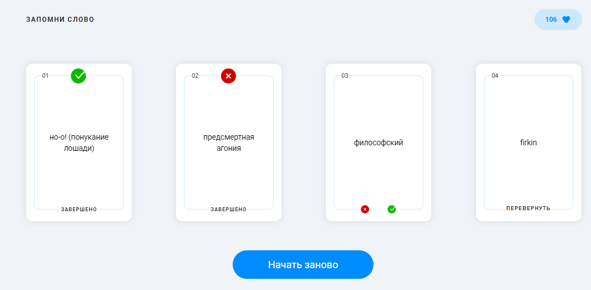

# Запомни слово

Приложение для тренировки запоминания иностранных слов.
Пользователю показываются карточки с английскими словами. Карточку можно перевернуть, чтобы увидеть перевод, а затем отметить, запомнил ли он слово или нет.
Если слово запомнено — начисляется +10 очков. Если слово не запомнено — снимается –4 очка.



## Начало работы 

1. Установите `node.js` (поддерживаемая версия: 22.18.0+)
2. Установите зависимости с помощью:

    ```shell
    npm ci
    ```
3. Запустите локально translation-api, выбрав бинарник под вашу ОС и архитектуру:

    ```shell
    ./translation-api api-<os>-<arch>[.exe]
    ```
4. Запустите проект командой:

    ```shell
    npm run dev
    ```
